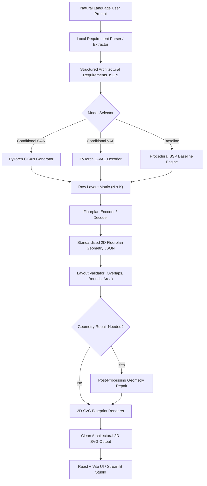

# System Architecture & Pipeline Design

## Prompt-Based 2D Floor Plan Generation Using GAN and VAE

This document details the end-to-end software and generative AI pipeline architecture.

---

## 1. High-Level Flowchart

---

## 2. Component Descriptions

### **Requirement Parser (`backend/routers/requirements.py`)**
Converts freeform prompts (*"Create a modern college library of 30m x 20m with reading hall..."*) into structured requirements (`building_type`, `width`, `length`, `floors_count`, `rooms`).
Operates deterministically without cloud API dependencies (e.g. Gemini).

### **Generative AI Models (`models/`)**
1. **Conditional GAN (`models/gan/`)**: Adversarial generator trained on layout tensors condition-weighted by room counts and bounding dimensions.
2. **Conditional VAE (`models/vae/`)**: Variational autoencoder mapping layout topologies into a continuous 64-dimensional latent space.
3. **BSP Baseline (`backend/services/generative_floorplan_service.py`)**: Procedural Binary Space Partitioning benchmark.

### **Layout Validator (`backend/services/layout_validator.py`)**
Calculates objective spatial scores:
- Axis-aligned bounding box overlap detection ($m^2$)
- Outer boundary compliance
- Minimum dimension thresholding ($> 1.5m$)
- Unused building area ratio
- Required room category coverage

### **SVG Blueprint Renderer (`backend/services/floorplan_service.py`)**
Converts standardized room dictionaries into publication-ready 2D SVG architectural blueprints featuring background grid lines, thick interior/exterior walls, door swing arcs, glass window cutouts, title blocks, and main entrance indicators.
